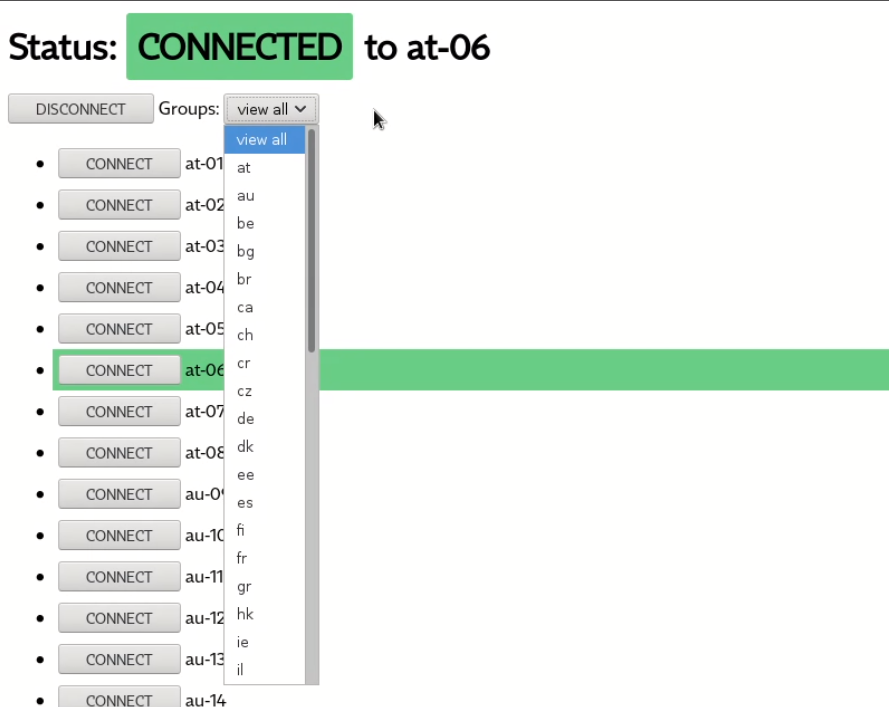

# ovpn-nodejs

Run OpenVPN inside docker container. Connect using Proxy. Choose and change from supplied `.ovpn` files.

```
version: '3.4'
services:
  vpn:
    build: .
    container_name: vpn
    restart: unless-stopped
    sysctls:
      - net.ipv6.conf.all.disable_ipv6=0
    cap_add:
      - net_admin
    volumes:
      - /dev/net:/dev/net:z
      - ./vpn:/vpn
```



## Openvpn authentication

If your ovpn configuration contains this line `auth-user-pass` you need to supply authentication file.

Create `.auth` file in your `vpn` folder. First line will be username, second line will be your password. And then replace it in all your files:

```
find . -type f -name "*.ovpn" -print0 | xargs -0 sed -i "s/^auth-user-pass$/auth-user-pass \/vpn\/.auth/g"
```

## Env

### File regex

Match only files matching given RegExp. In filename will be this part omitted.

```
FILE_REGEXP: '\.(ovpn|conf)$$'
```
Note: Use `$$` in docker-compose for `$`.

Example:

* `\.(ovpn|conf)$` -> foo.bar -> *ignored*
* `\.(ovpn|conf)$` -> homelab.ovpn -> homelab
* `\.ovpn` -> homelab.ovpn -> homelab
* `\.ovpn` -> my.ovpn.server.ovpn -> my.server
* `myvpn` -> server01.myvpn.ovpn -> server01.ovpn

### Group regex

First matching group of this regex will be used to group files.

```
GROUP_REGEXP: '^([a-z]+)-'
```

Example:

* sk-server01.ovpn
* sk-server02.ovpn
* sk-server03.ovpn
* de-server01.ovpn
* de-server02.ovpn

Groups:

* de
* sk

